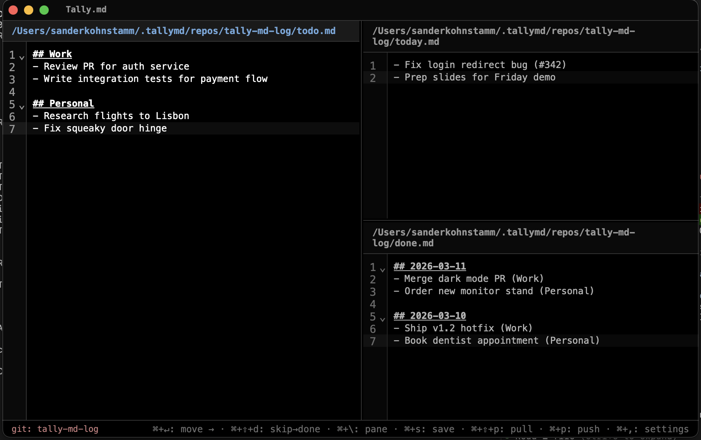

# Tally.md

A markdown todo app. Three panes: **Todo → Today → Done**.



Your data is just three markdown files. Move items forward with `Cmd+Enter`, and they flow through your day. Done items get a date header and a breadcrumb showing where they came from.

Syncs via git. 8 themes. All keyboard-driven.

## Install

Download from [Releases](https://github.com/sanderkohnstamm/tally-md/releases), or build from source:

```
cd desktop
npm install
npm run package
```

## Develop

```
cd desktop
npm install
npm run dev
```

## Tech

[Tauri 2](https://tauri.app/) + [CodeMirror 6](https://codemirror.net/). No frameworks, no Electron.
